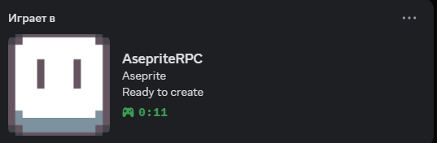

# 🎨 Aseprite Discord Rich Presence

> Beautiful and informative Discord Rich Presence for Aseprite that shows what you're currently working on!

## ✨ Features

- 🎯 **Real-time file detection** - Shows current file name and type
- ⚡ **Fast updates** - 3-second refresh rate for instant changes
- 🎨 **Beautiful display** - Clean, professional Rich Presence
- 🔄 **Smart monitoring** - Only runs when Aseprite is active
- 🌈 **Colorful console** - Beautiful colored terminal output
- 📁 **Multiple file types** - Supports .ase, .png, .gif, .jpg and more

## 🖼️ What it looks like


**Different file types:**
- `[background.png]` → `PNG image`
- `[animation.gif]` → `GIF animation` 
- `[sprite.ase]` → `Aseprite file`

## 🚀 Quick Start

### Prerequisites
- Python 3.7+
- Discord running
- Aseprite installed

### Installation

1. **Clone the repository:**
```bash
git clone https://github.com/YOUR_USERNAME/aseprite-discord-rpc.git
cd aseprite-discord-rpc
```

2. **Install dependencies:**
```bash
# Windows (double-click)
install.bat

# Or manually
pip install colorama pypresence psutil pywin32
```

3. **Setup Discord Application:**
   - Go to [Discord Developer Portal](https://discord.com/developers/applications)
   - Create **New Application** named "Aseprite"
   - Copy **Application ID**
   - Upload icon to **Rich Presence → Art Assets** as `aseprite_icon`

4. **Configure the script:**
   - Open `aseprite_rpc.py`
   - Replace `self.client_id = "ClientID"` with your Application ID

5. **Run:**
```bash
# Windows (double-click)
start_rpc.bat

# Or manually  
python aseprite_rpc.py
```

## 🎯 How it works

1. **Launch the script** - It waits for Aseprite to start
2. **Open Aseprite** - Rich Presence connects to Discord
3. **Work on files** - Your current file appears in Discord status
4. **Close Aseprite** - Script automatically stops

## ⚙️ Configuration

Edit `aseprite_rpc.py` to customize:

```python
# Update intervals
self.update_interval = 3  # Status update frequency (seconds)
self.cache_update_interval = 2  # Process cache refresh

# File type descriptions
file_types = {
    '.ase': 'Aseprite file',
    '.png': 'PNG image', 
    '.gif': 'GIF animation',
    # Add your custom types here
}
```

## 🛠️ Troubleshooting

**❌ "Discord connection error"**
- Make sure Discord is running
- Check your Application ID is correct
- Try restarting Discord

**❌ "Aseprite not detected"**
- Ensure Aseprite is running
- Try running script as Administrator
- Check if process name is `aseprite.exe` in Task Manager

**❌ "Images not showing"**
- Wait 15 minutes after uploading to Developer Portal
- Check image names match exactly: `aseprite_icon`
- Ensure images are approved by Discord

## 🎨 Screenshots

### Console Output
```
    ╔═══════════════════════════════════════╗
    ║   🎨 ASEPRITE DISCORD RICH PRESENCE   ║
    ║                                       ║
    ║        Made with ❤️  for artists      ║
    ╚═══════════════════════════════════════╝

📋 Before running make sure:
   1. Dependencies installed: pip install colorama pypresence psutil pywin32
   2. Discord application created in Developer Portal
   3. Application ID specified in code
   4. Images uploaded for Rich Presence

╔═════════════════════════════════════════════════╗
║         🎨 ASEPRITE DISCORD RICH PRESENCE        ║
╚═════════════════════════════════════════════════╝

✅ Connected to Discord
🎨 Starting Aseprite monitoring...
📁 Opened file: character_sprite.ase
🔄 Status updated: character_sprite.ase (Aseprite file)
```

## 📦 File Structure

```
aseprite-discord-rpc/
├── aseprite_rpc.py      # Main script
├── requirements.txt     # Python dependencies
├── install.bat         # Windows installer
├── start_rpc.bat       # Windows launcher
└── README.md           # This file
```

## 🤝 Contributing

1. Fork the repository
2. Create feature branch (`git checkout -b feature/amazing-feature`)
3. Commit changes (`git commit -m 'Add amazing feature'`)
4. Push to branch (`git push origin feature/amazing-feature`)
5. Open Pull Request

## 📄 License

This project is licensed under the MIT License - see the [LICENSE](LICENSE) file for details.

## ❤️ Acknowledgments

- Made with love for the pixel art community
- Inspired by the need for better Aseprite integration
- Thanks to all artists who create amazing pixel art!

## 🔗 Links

- [Aseprite Official Website](https://www.aseprite.org/)
- [Discord Developer Portal](https://discord.com/developers/applications)
- [pypresence Documentation](https://qwertyquerty.github.io/pypresence/)

---

**⭐ If you find this useful, please star the repository!**
